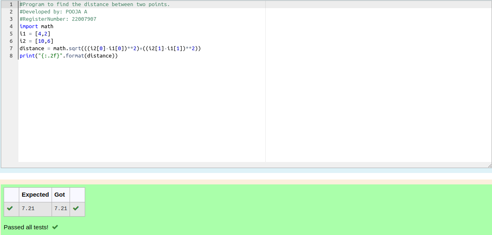

# DISTANCE-BETWEEN-TWO-POINTS

## AIM:
To write a python program to find the distance between two 2 points

## ALGORITHM:
### Step 1: 
type import math
### Step 2: 
take the values as i1 and i2
### Step 3: 
Substitute the values in the distance formula  
### Step 4: 
type print to get output
### Step 5: 
end the program

### PROGRAM:
```python
#Program to find the distance between two points.
#Developed by: POOJA A
#RegisterNumber: 22007907
import math
i1 = [4,2]
i2 = [10,6]
distance = math.sqrt(((i2[0]-i1[0])**2)+((i2[1]-i1[1])**2))
print("{:.2f}".format(distance))
```

### OUTPUT:


### RESULT:
Thus Distance between 2 points has been successfully executed
